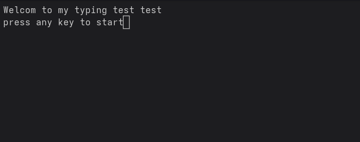
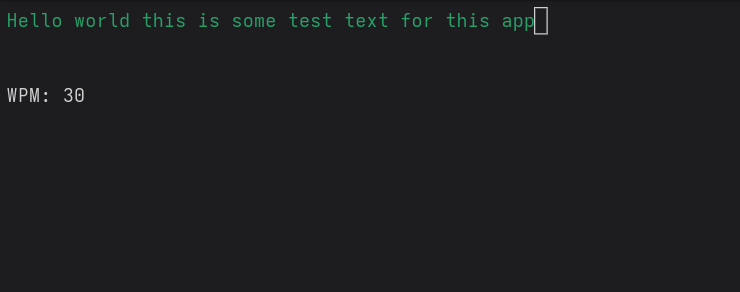

# ⌨️ Terminal Typing Speed Test (Python + curses)

A terminal-based typing speed test application built with Python's `curses` module. It calculates your Words Per Minute (WPM) as you type a given sentence and highlights correct and incorrect characters in real-time.

## 🚀 Features

- Real-time typing feedback with color-coded correctness.
- Live WPM calculation.
- Works entirely in the terminal.
- Simple and intuitive UI using `curses`.

## 🎯 How It Works

- The app displays a target sentence.
- You type the sentence as fast and accurately as you can.
- The app updates your WPM while you type.
- When you finish typing the full sentence correctly, the test ends.

## ✅ Color Code

- ✅ Green: Correct character
- ❌ Red: Incorrect character
- ⚪ White: Default text & WPM display


## 🛠️ Requirements

- Python 3.6+
- Unix-like terminal (Linux/macOS or WSL on Windows)

> ⚠️ `curses` does not natively support Windows Command Prompt. Use WSL or a compatible terminal emulator (e.g. Windows Terminal + WSL).

## 📦 How to Run

1. Clone the repository or save the code to a `.py` file:

   ```bash
   git clone https://github.com/Mohamed-Hamada-RP/Speed-Typing-Test.git
Run the script:


python3 main.py
⌨️ Controls
Start typing to begin the test.

Backspace to delete characters.

ESC to exit the test early or after completion.


main.py        # Main application file
README.md      # Project description and instructions

## 🧪 Demo Text
Hello world this is some test text for this app


## 🖥️ Sample Output

Here's what it looks like while running in your terminal:




👨‍💻 Author
Mohamed Hamada
Python Developer | DevOps Learner
GitHub: @Mohamed-Hamada-RP

